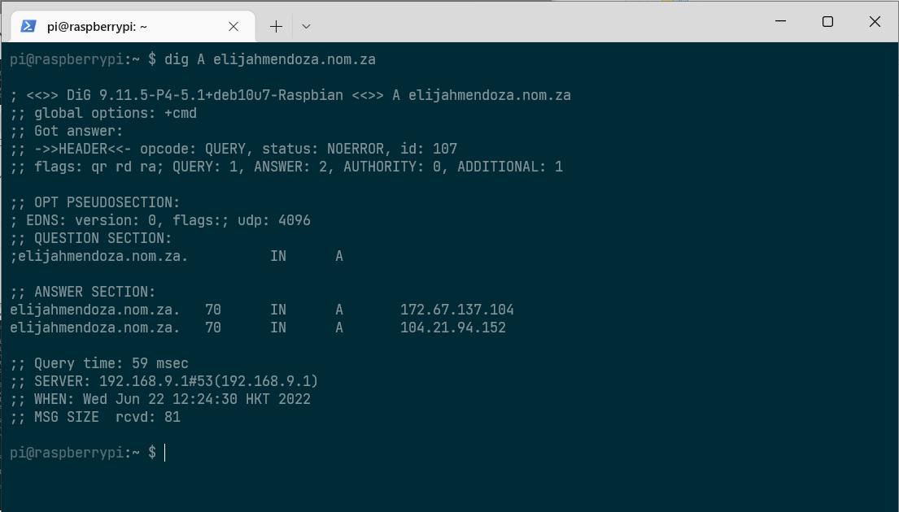

The first stage of [The Unified Kill Chain](https://www.unifiedkillchain.com/) is *reconnaissance*. And reconnaissance begins with the wealth of information available through *passive reconnaissance*.
---
In a few words, passive recon is researching about a target through public means. For a brief primer on this type of research, I took a [TryHackMe room](https://tryhackme.com/jr/passiverecon) on it. This article follows the flow of my learnings through that room.
On the command line, there are a few essential utilities to reveal this data without the target necessarily knowing you’re researching about them. I find these command-line tools far more efficient than their Google-and-GUI counterparts.

Because these commands did not come installed on my Raspberry Pi, I had to run `sudo apt install dnsutils whois`.

The `whois` command works like the [first few search results for “WHOIS lookup”](https://duckduckgo.com/?t=ffab&q=whois+lookup&ia=web). It is useful for determining if a domain name with a common extension is registered and who the registrar is. Occasionally, someone registers a domain without private information protection, so it all appears in the lookup results. 

 has a lot of personal information “redacted for privacy.”](./1462eca7bac16bb08233cebabd78c27adc249c05.png)

Interestingly, certain TLDs like `.ph` don’t play well with `whois`. For some, the command will point you to where a WHOIS database is available, but it won’t query it for you.

Onto `dig` and `nslookup`! These commands tell you more about a website and its server through DNS records, although this information can also be hidden through proxies like Cloudflare. 

Another useful tool for sniffing out public data on domains [i](http://shodan.io)s [dnsdumpster.com](http://dnsdumpster.com). Thankfully, although it is a GUI tool, it does’t fall into the category of slow-and-ad-ridden GUIs. DNSdumpster surprised me with how much about my personal website is visible to the world.

](./f39c3c18056aa132205b361d5f4512361f2037e7.png)

Messing around with these basic tools, I realized two things. First, as a researcher, there is a vast amount of low-hanging fruit publicly available, especially for poorly configured domains. Secondly, for me and the domains I manage, this is an equal danger. Nobody can track exactly who does passive reconnaissance on them. Hence, security through obscurity means nothing unless you know what attackers can silently and easily discover about you.

